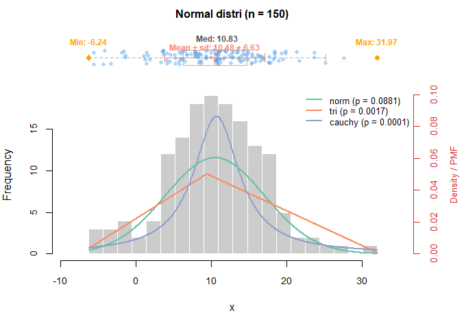
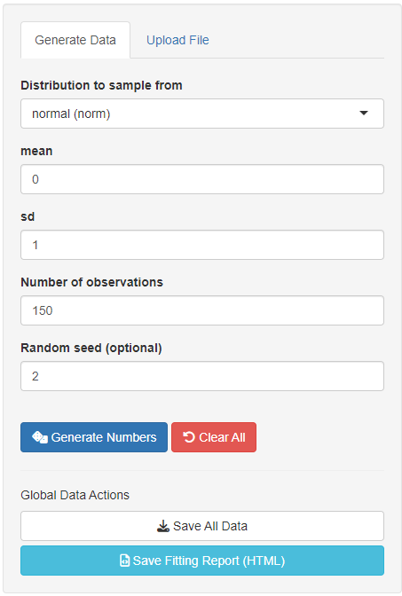
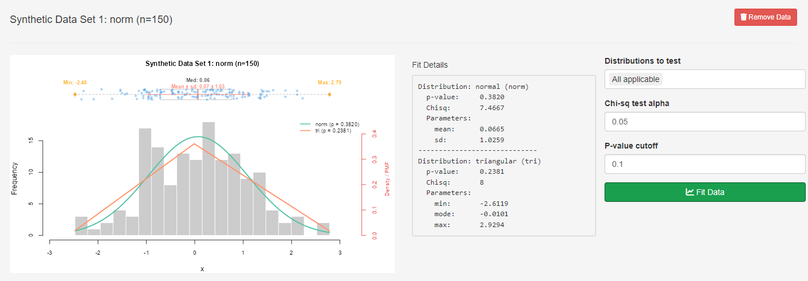

# Distribution Fitting and Pseudo-Random Number Generator


## 1. Program Overview

This app provides a comprehensive library in **R** (with an interactive **Shiny Web Interface**) for generating pseudo-random numbers, as well as fitting empirical data to standard discrete and continuous probability distributions, estimating parameters, and conducting $\chi^2$ goodness-of-fit tests.

### Key Features
* **Pseudo-Random Number Generation:** Built-in pseudo-random generator implementing a modified Desert Island multiplicative linear congruential generator (LCG) with warm-up steps and fallback mechanisms.
* **Distribution Parameter Estimation:** Fits continuous and discrete distributions using Maximum Likelihood Estimation (MLE) or Method of Moments (MoM).
* **Goodness-of-Fit ($\chi^2$) Testing:** Evaluates candidate fits with dynamic binning and merged tail cells (minimum expected frequency $E_i \ge 5$).
* **Interactive Shiny Dashboard:** Generate synthetic distributions, upload datasets, visualize interactive boxplots/histograms, overlay fitted probability densities, and export reports in HTML/TSV formats.

---

## 2. Supported Distributions

| Type | Distribution | Abbr. | Fitted Parameters | Domain |
| :--- | :--- | :--- | :--- | :--- |
| **Discrete** | Bernoulli | `bern` | $p$ (`prob`) | $x \in \{0, 1\}$ |
| | Binomial | `binom` | $n$ (`size`), $p$ (`prob`) | $x \in \{0, 1, \dots, n\}$ |
| | Geometric | `geom` | $p$ (`prob`) | $x \in \{1, 2, 3, \dots\}$ |
| | Negative Binomial | `nbinom` | $r$ (`size`), $p$ (`prob`) | $x \in \{r, r+1, \dots\}$ |
| | Poisson | `pois` | $\lambda$ (`lambda`) | $x \in \{0, 1, 2, \dots\}$ |
| **Continuous** | Uniform | `unif` | $a$ (`min`), $b$ (`max`) | $x \in [a, b]$ |
| | Normal | `norm` | $\mu$ (`mean`), $\sigma$ (`sd`) | $x \in (-\infty, \infty)$ |
| | Triangular | `tri` | $a$ (`min`), $b$ (`mode`), $c$ (`max`) | $x \in [a, c]$ |
| | Exponential | `exp` | $\lambda$ (`rate`) | $x \in [0, \infty)$ |
| | Erlang | `erlang` | $k$ (`shape`), $\lambda$ (`rate`) | $x \in [0, \infty)$ |
| | Gamma | `gamma` | $\alpha$ (`shape`), $\beta$ (`rate`) | $x \in (0, \infty)$ |
| | Beta | `beta` | $\alpha$ (`shape1`), $\beta$ (`shape2`) | $x \in (0, 1)$ |
| | Weibull | `weibull` | $k$ (`shape`), $\lambda$ (`lambda`) | $x \in [0, \infty)$ |
| | Cauchy | `cauchy` | $x_0$ (`location`), $\gamma$ (`scale`) | $x \in (-\infty, \infty)$ |

---

## 3. Mathematical & Estimation Details

### Discrete Distributions

#### 1. Bernoulli Distribution: $\text{Bern}(p)$
* **Estimation:** $p = \frac{1}{m} \sum_{i=1}^m x_i$

#### 2. Binomial Distribution: $\text{Binom}(n, p)$
* **Log-Likelihood:**

  $$\mathcal{L}(x \mid n, p) = \sum_{i=1}^m \left[ \ln \binom{n}{x_i} + x_i \ln p + (n - x_i) \ln (1-p) \right]$$
  
  *(Optimized across integer values of $n \ge \max(x_i)$ up to an upper bound of 1000.)*
  
* **Method-of-Moment:**

    $$p = \frac{S^2}{\bar{X}}$$

    $$n = \frac{\bar{X}}{p}$$

    *where $\bar{X}=\frac{1}{m} \sum_{i=1}^m x_i$ , and $S^2 = \frac{1}{m-1} \sum_{i=1}^m (x_i - \bar{X})$*

#### 3. Geometric Distribution: $\text{Geom}(p)$
* **Log-Likelihood:**
  
  $$\mathcal{L}(x \mid p) = \left( \sum_{i=1}^m x_i - m \right) \ln(1-p) + m \ln p$$

#### 4. Negative Binomial Distribution: $\text{NBinom}(r, p)$

*Modeled as total trials $x$ until the $r^{\text{th}}$ success, $0 < p < 1, 1 \le r \le \min(x_i)$*
* **Log-Likelihood:**
  
  $$\mathcal{L}(x \mid r, p) = \sum_{i=1}^m \left[ \ln \binom{x_i - 1}{r - 1} + (x_i - r) \ln(1-p) + r \ln p \right]$$

* **Method-of-Moment:**

  $$p = \frac{\bar{X}}{S^2 + \bar{X}},r = \lfloor p \cdot \bar{X} \rceil$$
  
  *where $\bar{X} = \frac{1}{m} \sum_{i=1}^m x_i , \quad S^2 = \frac{1}{m-1} \sum_{i=1}^m (x_i - \bar{X})$*

#### 5. Poisson Distribution: $\text{Pois}(\lambda)$
* **Log-Likelihood:**

  $$\mathcal{L}(x \mid \lambda) = \ln \lambda \sum_{i=1}^m x_i - m\lambda - \sum_{i=1}^m \ln(x_i!)$$

---

### Continuous Distributions

#### 1. Uniform Distribution: $\text{Unif}(a, b)$
* **Estimates:** $\hat{a} = \min(x), \quad \hat{b} = \max(x)$

#### 2. Normal Distribution: $\text{Norm}(\mu, \sigma)$
* **Log-Likelihood:**

   $$\mathcal{L}(x \mid \mu, \sigma) = -\frac{\sum_{i=1}^m (x_i - \mu)^2}{2\sigma^2} - 0.5 m \ln(2\pi\sigma^2)$$

* **Method-of-Moment:**

$$ \hat{\mu}  = \frac{1}{m} \sum_{i=1}^m x_i, \quad \hat{\sigma} = \sqrt{\frac{1}{m}\sum_{i=1}^m (x_i - \hat{\mu})^2} $$

#### 3. Triangular Distribution: $\text{Tri}(a, b, c)$
* Initial estimates via Method of Moments:

  $$\hat{a} = \min(x_i), \quad \hat{c} = \max(x_i), \quad \hat{b} = 3\bar{X} - \hat{a} - \hat{c}$$
  
* Refined by maximizing **log-likelihood** (adding $\epsilon = 10^{-6}$ for numerical stability):

  $$\mathcal{L}(x \mid a, b, c) = \begin{cases} \sum_{i=1}^m \left[ \ln 2 + \ln(x_i - a + \epsilon) - \ln(b - a + \epsilon) - \ln(c - a + \epsilon) \right], & x < b \\ \sum_{i=1}^m \left[ \ln 2 + \ln(c - x_i + \epsilon) - \ln(c - b + \epsilon) - \ln(c - a + \epsilon) \right], & x \ge b \end{cases}$$

#### 4. Exponential Distribution: $\text{Exp}(\lambda)$
* **Log-Likelihood:**

  $$\mathcal{L}(x \mid \lambda) = m \ln \lambda - \lambda \sum_{i=1}^m x_i$$

#### 5. Gamma Distribution: $\text{Gamma}(r, \lambda)$
* **Log-Likelihood:**

  $$\mathcal{L}(x \mid r, \lambda) = m r \ln \lambda + (r-1) \sum_{i=1}^m \ln(x_i) - \lambda \sum_{i=1}^m x_i - m \ln \Gamma(r)$$

#### 6. Beta Distribution: $\text{Beta}(\alpha, \beta)$
* **Method-of-Moments:**

  $$\hat{\alpha} = \frac{\hat{\beta} \bar{X}}{1 - \bar{X}}, \quad \hat{\beta} = \frac{\bar{X}(1 - \bar{X})^2}{S^2} - 1 + \bar{X}$$

  *Where $\bar{X} = \frac{1}{m}\sum x_i, \quad S^2 = \frac{1}{m-1}\sum(x_i - \bar{X})^2$*

#### 7. Erlang Distribution: $\text{Erlang}(k, \lambda)$
* **Log-Likelihood:**

  $$\mathcal{L}(x \mid k, \lambda) = m k \ln \lambda + (k-1) \sum_{i=1}^m \ln(x_i + \epsilon) - \lambda \sum_{i=1}^m x_i - m \ln \Gamma(k)$$

  <p align="center"><i>(Iteratively optimizes over integer shape values k in {1, 2, ..., 500}).</i></p>

* **Method-of-Moment:**
  $$ \hat{\lambda} = \frac{\bar{X}}{S^2}, \quad \hat{k} = \lfloor \hat{\lambda} \bar{X} \rceil$$

    *Where $\bar{X} = \frac{1}{m}\sum_{i=1}^m x_i$  and  $S^2 = \frac{1}{m-1}\sum_{i=1}^m(x_i - \bar{X})^2$*

#### 8. Weibull Distribution: $\text{Weibull}(r, \lambda)$
* **Log-Likelihood:**

  $$\mathcal{L}(x \mid r, \lambda) = m \ln r + m r \ln \lambda + (r-1)\sum_{i=1}^m \ln(x_i + \epsilon) - \lambda^r \sum_{i=1}^m x_i^r$$

#### 9. Cauchy Distribution: $\text{Cauchy}(x_0, \gamma)$
* **Log-Likelihood:**

  $$\mathcal{L}(x \mid x_0, \gamma) = -m \ln(\pi \gamma) - \sum_{i=1}^m \ln \left[ 1 + \left( \frac{x_i - x_0}{\gamma} \right)^2 \right]$$

---

## 4. Pseudo-Random Number Generation Algorithms

Uniform variates $U \sim \text{Unif}(0,1)$ are generated via the Multiplicative Congruential Generator:

$$\text{Seed}_{n+1} = (16807 \times \text{Seed}_n + 127773) \pmod{2^{31} - 1}$$

| Distribution | Generation Algorithm / Sampling Method |
| :--- | :--- |
| **Discrete Unif** | $X = \lfloor a + (b - a) U \rceil$ |
| **Bernoulli** | $X = 1$ if $U \le p$, else $0$ |
| **Binomial** | Convolution: $X = \sum_{i=1}^r B_i$, where $B_i \sim \text{Bern}(p)$ |
| **Geometric** | Inverse-Transform: $X = \left\lceil \frac{\ln U}{\ln(1-p)} \right\rceil$ |
| **Neg Binomial** | Convolution: $X = \sum_{i=1}^r G_i$, where $G_i \sim \text{Geom}(p)$ |
| **Poisson** | • $\lambda \le 20$: Exponential inter-arrival summation: $X = \max\{i : -\frac{1}{\lambda} \sum_{j=0}^i \ln U_j \le 1\}$<br>• $\lambda > 20$: Normal approximation fallback: $X = \max(0, \lfloor \lambda + Z\sqrt{\lambda} + 0.5 \rfloor)$ |
| **Normal** | • **Box-Muller:** $Z_1 = \sqrt{-2\ln U_1}\cos(2\pi U_2)$<br>• **Polar Method:** Acceptance-Rejection on unit circle |
| **Exponential** | Inverse-Transform: $X = -\frac{\ln(1-U)}{\lambda}$ |
| **Triangular** | Inverse CDF: $X = a + \sqrt{U(b-a)(c-a)}$ if $U \le \frac{b-a}{c-a}$, else $c - \sqrt{(1-U)(c-b)(c-a)}$ |
| **Erlang** | Summation of Exponentials: $X = -\frac{1}{\lambda}\sum_{i=1}^k \ln U_i$ |
| **Gamma** | • $\alpha < 1$: GS Algorithm (Ahrens and Dieter, 1974)<br>• $\alpha > 1$: GB Algorithm (Cheng, 1977)<br>• $\alpha = 1$: Exponential variate |
| **Beta** | Ratio of Gammas: $X = \frac{X_1}{X_1 + X_2}$, where $X_1 \sim \text{Gamma}(\alpha, 1), X_2 \sim \text{Gamma}(\beta, 1)$ |
| **Cauchy** | Inverse-Transform: $X = x_0 + \gamma \tan\left( \pi (U - 0.5) \right)$ |

---

## 5. Repository Structure
```text
├── ui.r                      # Shiny UI 
├── server.r                  # Shiny Server
├── main.r                    # Global variant, importing routines, ploting func
├── R/               
│   ├── gofTest.chisq.r        # Discrete & continuous Chi-square goodness-of-fit functions
│   ├── prob_fit.r             # MLE / MoM distribution parameter estimators
│   ├── prn_generator.r        # Pseudo-random number generators
│   ├── utilities.r            # Helper routines and output formatters
│   └── distribution.names.txt # Metadata registry of supported distributions
├── plots/                     # example plots
├── test/     
│   ├── test_data.txt
```

---

## 6. Command line usage examples

```{r }
source("./main.r")

# 1. Set seed and generate sample dataset (Exponential distribution)
set_seed(32)
(paramList <- makeParams('norm'))
$mean
[1] 9.637029

$sd
[1] 7.115604

sim.data <- xnorm(150, paramList$mean, paramList$sd)
summary(sim.data)
   Min. 1st Qu.  Median    Mean 3rd Qu.    Max. 
 -6.239   6.344  10.830  10.477  14.629  31.968 

# 2. Estimate parameters assuming Normal vs. Triangular distribution
(para.Est1  <- xnormFit(sim.data))
$mean
[1] 10.47736

$sd
[1] 6.611617

(para.Est2 <- xtriFit(sim.data))
$min
[1] -7.456185

$mode
[1] 9.38996

$max
[1] 32.39613

# 3. Fit data against Exponential distribution using Chi-Square Test
fit1 <- distrEstimate(sim.data, distribution = 'norm', estimate.parameters = TRUE)

fit1[[1]]$parameters
     mean        sd 
10.477357  6.611617 

fit1[[1]]$p.value
[1] 0.08814848

# 4. Find the overall best-fitted distribution among all choices
fit2 <- distrEstimate(sim.data, distribution = NULL, estimate.parameters = TRUE, return.best = TRUE)
fit2[[1]]$distr.name
[1] "normal" "norm"  
fit2[[1]]$p.value
[1] 0.08814848

# 5. Plot simulated data and fitting result.
top.fit <- getTopFits(sim.data)
lapply(seq_len(length(top.fit)), function(i) top.fit[[i]]$distr.name)
[[1]]
[1] "normal" "norm"  

[[2]]
[1] "triangular" "tri"       

[[3]]
[1] "cauchy"

plotDistr(sim.data, top.results = top.fit, is.fitted = T, title = "Normal distri (n = 150)")

```



## 7 App usage examples

An interactive App is available at [DistriFit App](https://shinyio.).

You can also download this repository and run it through R console.

```{r}
library(shiny)
runApp('DistriFit')
```
The app support generating synthetic data, or taking data from a .csv, .txt, or .tsv file. When generating synthetic data, a seed can be set for reproducibility. Each set of generated data will be plotted and fitted separately. When uploading data from a file, each column will be taken in as individual set, ploted and fitted separately. 
*Note that you need a minimal of 30 data points for reliable distribution fitting.*

#### App input Interface 
<table style="width:80%; border:none;">
  <tr>
    <td style="width:50%; border:none;"></td>
    <td style="width:50%; border:none;"></td>
  </tr>
</table>

#### App fitting result



